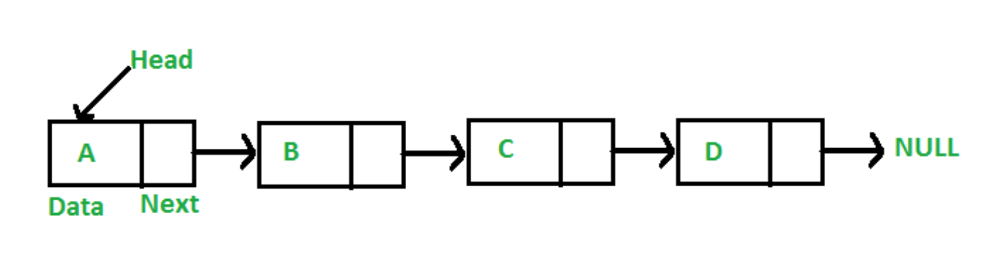

# Day 1

## Java review contents

- [1-day Java review hands-on lab document](https://github.com/sashinpivotal/dsa-java-review-doc)
- [1-day Java review hands-on lab solution code](https://github.com/sashinpivotal/dsa-java-review-code)

## Java questions (Sang asks these questions to gauge students' Java knowledge)

- When do you want to use Java interface?
- What is encapsulation? What is abstraction?
- What is Polymorphism? What are the examples of polymorphism?
- What is difference between "protected" vs "package private or default" access modifier?
- What is "Single responsibility principle of SOLID"? Why should we use it?
- What is "Open for extension Closed for modification of SOLID" design principle?
- What is dependency injection and why it is such an important software design concept?
- What are the major differences between Set vs List?
- When is a static method?  Why do you want to create a method as a static method? Is it a good idea to create a static method which maintains a state?
- What is a functional interface in Java?
- What is Lambda expression? Where do you want use it?
- What is Generics and why you want to use it in your code?
- What is the difference between Java Collection vs Java Streams? (We are NOT talking about Java I/O Stream.)
- What is Optional class for in Java?
- What is a design pattern? What is "Strategy" pattern?
- What is dependency management in your project?

## Java resources (in addition to class provided ones)

- [Sang Shin's Java presentations](https://github.com/sashinpivotal/java-presentations)

## Individual (or group) tutorial sign-up sheet

- Two 30-minute slots are available before the class
- Please make sure to sign up the day before the tutorial session
- [Sign-up sheet](https://docs.google.com/document/d/1ZC7L3Zd1LXeG40vW3fA0k4TRCLETNHrWI13BPLt2z74/edit)

## .gitignore example file

```
# Operating System Files

*.DS_Store
Thumbs.db
*.sw?
.#*
*#
*~
*.sublime-*

# Build Artifacts

.gradle/
build/
target/
bin/
out/
dependency-reduced-pom.xml

# Eclipse Project Files

.classpath
.project
.metadata
.loadpath
bin/
.settings/

# IntelliJ IDEA Files

*.iml
*.ipr
*.iws
*.idea

.vscode/
README.html
```

## git and GitHub exercise (individual exercise)

- cd to project directory
- create **.gitignore** file in the project root with the following content below
- type **git init**
- type **git add .**
- type **git commit -m "initial commit"**

- create a new repo in GitHub giving a same name of your project - do not create README.md
- cd to project directory
- type **git remote add origin \<url of the GitHub repo\>**
- type **git push -u origin main** 

## git and GitHub exercise (Group exercise)

- Choose one person in your group as project-leader
- THe project-leader add other team members as collaborators
- The collaborators accept the collaborator invitation
- The collaborators clone the project-leader's project
- Start collaboration

## IntelliJ Shortcut keys

### IntelliJ Shortcut keys for Mac:

- Run app and test
  - CTRL+SHIFT+R (run the app/test)
  - CTRL+R(rerun the app/test)
- Editing
  - CMD+B (go to the source code of a class or method)
  - ALT+Return (Quick fix for compiler error)
  - CMD+SHIFT+Return (Complete current statement)
  - CMD+N (Generate)
  - SHIFT+F6 (Rename)
  - CMD+ALT+V (extract return value into a local variable)
  - F2, SHIFT+F2 (Go to next/previous error)
  - CMD+Left (navigate back)
  - CMD+Right (navigate forward)
- Window management
  - CMD+SHIFT+F12 (maximize/minimize editor window)
  - CMD+SHIFT+' (Maximize/minimize tool window)
- Testing
  - CMD+SHIFT+T (go to target/test code)
- File search
  - CMD+O (find class)
  - CMD+SHIFT+O (find file)
- String search
  - CMD+F (search within a file)
  - CMD+SHIFT+F (search within the project)

### IntelliJ Shortcut keys for Windows:

- Run app and test
  - CTRL+SHIFT+F10 (run the app/test)
  - SHIFT+F5 (rerun the app/test)
  - SHIFT+F10 (rebuild/rerun)
- Editing
  - CTRL+B (go to the source code of a class or method)
  - ALT+Enter (quick fix for compiler error)
  - CTRL+SHIFT+Enter (complete current statement)
  - Alt+Ins (generate)
  - Shift+F6 (rename all instances of a variable)
  - CTRL+ALT+V (extract return value into a local variable)
  - F2, SHIFT+F2 (go to next/previous error)
  - Alt+Left (navigate back between classes)
  - Alt+Right (navigate forward between classes)
- Window management
  - CTRL+SHIFT+F12 (maximize/minimize editor window)
  - CTRL+SHIFT+F12 (maximize/minimize tool window)
  - Alt+F12 (open/close terminal window)
- Testing
  - CTRL+SHIFT+T (go to target/test code)
- File search
  - CTRL+N (find class)
  - CTRL+SHIFT+F (find file)

- [IntelliJ shortcut keys cheat sheet](https://www.jrebel.com/blog/intellij-shortcuts)

### How to enable function keys for certain apps in Mac

- [How to enable function keys for certain apps in Mac](https://www.techrepublic.com/article/how-to-permanently-display-the-function-keys-for-certain-apps-in-the-macbook-pro-touch-bar/)

# Day 2

## DS&A lab projects and IntelliJ

- How to open lab modules
  1. File->Open
  1. Choose "./workspace/dsa-labs" directory
  1. Then you will see all lab modules are displayed
  1. Choose any solution project and run it and verify its successful run

- How to add a new module
  1. File->New->Module
  2. Set the "Name" field to project name of your choice, i.e. "my-project"
  3. Make sure the "Location "field is set to "./workspace/dsa-labs/my-project"

## Binary and Octal Conversion

- Decimal number system

```
Possible numbers: 0, 1, 2, 3, 4, 5, 6, 7, 8, 9
decimal 324 = 3 * 100 + 2 * 10 + 4 * 1
decimal 902 = 9 * 100 + 0 * 10 + 2 * 1
```

- Binary number system

```
Possible numbers: 0, 1
binary  101 =         1 * 4 + 0 * 2 + 1 * 1 = decimal value 5
binary 1011 = 1 * 8 + 0 * 4 + 1 * 2 + 1 * 1 = decimal value 11
```

- Octal number system

```
Possible numbers: 0,1,2,3,4,5,6,7
octal  10 =          1 * 8 + 0 * 1 = decimal value 8
octal  17 =          1 * 8 + 7 * 1 = decimal value 15
octal 217 = 2 * 64 + 1 * 8 + 7 * 1 = decimal value 143
```

- Hexadecimal number system

```
Possible numbers: 0,1,2,3,4,5,6,7,8,9,A,B,C,D,E,F
A = decimal 10
B = decimal 11
C = decimal 12
D = decimal 13
E = decimal 14
F = decimal 15
hexadecimal 1A = 1 * 16 + A * 1 = decimal value 26
hexadecimal 1F = 1 * 16 + F * 1 = decimal value 31
hexadecimal 2D = 32+13 = decimal 45
```

## Lab 1.1 (binary string to decimal value conversion) pseudo-code

```java
    public static int convertBinaryStringToDecimalValue(String binaryString){
        // TODO-Lab1.1: return calculated decimal value converted from String binary
        // for-loop - start from the bottom of the string
        // - get the last character, and check if it is 1 or not
        // - if it is 1, compute value of that digit with the conversion
        //       - add it to the result
        // - change the conversion by the power of 2
        return 0;
    }
```

## Lab 1.2 (octal string to decimal value conversion) pseudo-code

- What are the differences between octal-decimal conversion and binary-decimal conversion?
  - conversion number base is now 8 instead of 2
  - there are 8 possible digits


## Optional exercise of "number string conversion to decimal value" (Do this only after you are done with Lab 1.1 and Lab 1.2)

- Write generic conversion code that handles all number systems:
  - binary
  - octal
  - decimal
  - hex-decimal

```java
// "numberBase" argument could be 2,8,10,16 to represent
// binary, octal, decimal, and hexa-decimal respectively
public static int convertFromGeneral(String toBeConvertedNumberString, 
                                     int numberBase) {

    int decimalValueResult = 0;
    
    //
    // TODO: write your code here
    //
    
    return decimalValueResult;
}
```

- Solution of the above code is below (this is not the most efficient code - see some refactoring suggestions below)

```java
    public static int convertFromGeneral(String toBeConvertedNumberString, int numberBase) {
        int conversion = 1;
        int decimalResult = 0;
  
        for (int i = toBeConvertedNumberString.length() - 1; i >= 0; i--) {
            int num = convertCharacterToDecimal(
                toBeConvertedNumberString, numberBase, i);
            decimalResult += num * conversion;
            conversion *= numberBase;
        }
        return decimalResult;
    }

    public static final int BASE10 = 10;
    private static int convertCharacterToDecimal(String toBeConverted, int numberBase, int i) {
        int num;
        if (numberBase <= BASE10) {
            num = convertNumberCharacterToDecimal(toBeConverted.charAt(i));
        } else {
            num = convertHexCharToDecimal(toBeConverted.charAt(i));
        }
        return num;
    }

    private static int convertNumberCharacterToDecimal(char c) {
        return Integer.parseInt(Character.toString(c));
    }

    private static int convertHexCharToDecimal(char c) {
        switch (c) {
            case 'A':
                return 10;
            case 'B':
                return 11;
            case 'C':
                return 12;
            case 'D':
                return 13;
            case 'E':
                return 14;
            case 'F':
                return 15;
            default:
                return convertNumberCharacterToDecimal(c);
        }
    }
```

- Refactor the above solution code using the following (Thanks to "Felicia Kenney")
  - Use "Character.getNumericValue()" for converting a character to decimal value
  - Use "Integer.parseInt(num, 16)" for converting hex char to decimal value

## Testing negative cases (in relation to Lab 1.3)

- Two different ways of testing if your code generates an exception correctly

```java
// This one just test if InvalidParameterException is thrown
@Test(expected = InvalidParameterException.class)
public void _convertFromOctal_should_throw_InvalidParameterException_given_octal_string_with_non_number_chars() throws InvalidParameterException {
    BinaryConvert.convertFromOctal("17a");
}

// This one also test if the exception message is correct as well
@Test
public void _convertFromOctal_should_throw_InvalidParameterException_given_octal_string_with_non_number_chars2() {
    String badOctalStr = "17a";
    try {
        BinaryConvert.convertFromOctal(badOctalStr);
        fail("Didn't throw exception");
    } catch (InvalidParameterException ipe) {
        assertEquals(badOctalStr, ipe.getMessage());
    }
}
```

- Example custom exception class

```java
public class MyNumberFormatException extends RuntimeException {

    public MyNumberFormatException(String message) {
        super(message);
    }
}
```

- [Number system youtube intro - watch the first ~4 minutes](https://www.youtube.com/watch?v=FFDMzbrEXaE&ab_channel=TheOrganicChemistryTutor)

- ["int" value range - see under "Numbers" section](https://www.i-programmer.info/ebooks/modern-java/5423-java-data-types-numeric-data.html#:~:text=128%20to%20127-,short%202%20bytes%20%2D32%2C768%20to%2032%2C767,4%20bytes%207%20decimal%20digits) 


## Big O notation

- Big O Notation
  
```
Big O notation gives an upper bound of the 
complexity in the "worst" case, helping 
to quantify performance as the input size 
becomes "arbitrarily large"(infinite input size)
```

- Big O examples
  - O(1)        - Constant time
  - O(log n)    - Logarithmic time
  - O(n)        - Linear time
  - O(n log n)  - Linearighmic time
  - O(n<sup>2</sup>) - Quadric time
  - O(n<sup>3</sup>) - Cubic time
  - O(n<sup>n</sup>) - Exponential time

- Big O rules
  - Different steps get added
    - O(a) + O(b) => O (a+b)
  - Drop constants
    - O(n + 3) => O(n)
    - O(2n) => O(n)
  - Drop non-dominant 
    - O(n + n<sup>2</sup>) => O(n<sup>2</sup>)
    - O(7 log n<sup>3</sup> + 15n<sup>2</sup> + 2n<sup>3</sup> + 8) => O(n<sup>3</sup>)

## Runtime complexity of Lab 1.4 - find intersected numbers

- Runtime complexity of neither arrays sorted
  - "O(n<sup>2</sup>)"
- Runtime complexity of one array sorted while the other array is not sorted 
  - "O(n log n) + O(n log n) -> O(2 * n log n) -> O(n log n)"
  - The first "O(n log n)" is for quick-sorting one array
  - The second "O(n log n)" is for binary searching for "n" items in the other array
- Runtime complexity of both arrays are sorted
  - "O(2 * n log n) + O(2n) -> O(2 * n log n) -> O(n log n)"
  - The first "O(2 * n log n)" is for quick-sorting two arrays
  - The "O(2n)" is going through "n" items in both arrays

## Resources (from homework sheet)

- [Introduction to Big O Notation (12 minutes)](https://www.youtube.com/watch?v=zUUkiEllHG0)
  
## Quick Quiz after Day 2

1. What does O(n) runtime complexity mean?
1. What is the runtime complexity of binary search in the form of Big O notation?
1. What are the differences between Checked Exception vs Unchecked exception?
1. What is the top-level Unchecked exception in Java?

# Day 3

## Bubble sort

- [Animated sorting](https://visualgo.net/en/sorting)
  
- logic of bubble sort

```
- initial array
15, 7, 12, 4, 17, 9, 5, 6

- The 1st iteration with k=1
7, 12, 4, 15, 9, 5, 6, [17]
- The 2nd iteration with k=2
7, 4, 12, 9, 5, 6, [15, 17]
- The 3rd iteration with k=3
4, 7, 9, 5, 6, [12, 15, 17]

```

- Is there any room for logic improvement to the following bubbleSort pseudo code?

```
    /*
    bubbleSort(array)
       n = length(array)
       for (k = 1 until n)
         for (j = 0 until n -1)
           if(array[j] > array[j + 1])
             swap(array, j, j + 1)
    */
```

## Recursive programming

### Recursive program characteristics

Every recursive program has the following two characteristics:

1. base condition - otherwise, "StackOverflowError" exception will occur
2. recurring and changed argument(s) that gets used in the base condition

### Recursive program example

```java
public class RecursiveMain {

    public static void main(String[] args) {
        int recursiveStartingCounter = 2000;
        new Hello().hello(recursiveStartingCounter);
    }

}

class Hello {

    public void hello(int counter) {    // recurring argument
        System.out.println(counter + ": hello");
        if (counter < 0) {              // base condition
            return;
        }
        hello(--counter);
    }
}
```

### Recursion related resource

- [Recursion Youtube video (11 minutes)](https://www.youtube.com/watch?v=k-7jJP7QFEM&t=2s&ab_channel=CodingwithJohn)
- [Recursion (20 minutes) - from homework sheet](https://www.youtube.com/watch?v=ngCos392W4w)
- [Recursion (12 minutes) - from homework sheet](https://www.youtube.com/watch?v=HXNhEYqFo0o)


## Binary Search using recursion

- Assumed the numbers are already sorted

```
sorted array: [1, 2, 3, 4, 7, 8, 9, 11, 14, 17, 20]
target: 4

- 1st phase [1, 2, 3, 4, 7]
- 2nd phase [4, 7]
- 3rd phase [4]
```

- What is the base condition?
- What is the recurring and changing arguments?


## Quick Sort

- Note that the QuickSort from [Animated sorting](https://visualgo.net/en/sorting) uses the first element as a Pivot for each partitioning iteration(while our example in the slide uses the last element as a pivot)

- [Quicksort: Partion'ing an array (5 minutes)](https://www.youtube.com/watch?v=MZaf_9IZCrc&ab_channel=KCAng)
  - He uses "i" to represent "top of lower partition" (after each partition'ing iteration)
  - Our presentation(slide #41, #42) uses "x" to represent the same
  - Our lab document (in lab 2.3a) uses "top" to represent the same

- [Lomundo quicksort youtube video (3 minutes)](https://www.youtube.com/watch?v=86WSheyr8cM&ab_channel=BukanCaraCepat)


## Merge Sort

- The following pseudo-code also works

```
// pseudo code:
//        i = start             // start of the 1st array
//        j = middle + 1        // start of the 2nd array
//        arrayTemp = initArrayOfSize(end - start + 1)
//        for (k = 0 until (end of arrayTemp))
//             if (i <= middle && j <= end) 
//                 if (array[i] <= array[j]) {
//                     arrayTemp[k] = array[i++]
//                 else
//                     arrayTemp[k] = array[j++]
//             else // end of one array is reached
//                  if (j > end) { // end of 2nd array reached
//                     arrayTemp[k] = array[i++];
//                  else           // end of 1st array reached
//                     arrayTemp[k] = array[j++];
//        copyArray(arrayTemp, array, start)
```

## Challenge/Quiz questions after Day 3

- What does "base case" or "base condition" mean in the recursive programming?
- If you call a method in recursive fashion without "base condition" check, what would happen?
- What is the "base case"/"base condition" of the quick sort?
- Can you explain how QuickSort works at the high level?

# Day 4

## Design patterns

- [Presentation slides](https://github.com/sashinpivotal/java-presentations/tree/main/design_patterns)
- [Example code](https://github.com/sashinpivotal/design-pattern-examples)

## Linked List resources



## Lab 2.5 - Singly Linked List

- This lab exposes you multiple dimensions
  - Generics
  - Singly Linked List
  - Recursive programming

- Please note that your task is to print the list in the reverse order (not reverse the linked list itself)

- In order to execute the above logic, you will run the following test

```java
    @Test
    public void reverseRecursivelyPositive() {
        // note: this is not a true test, just calling the method to see output
        custList.reverseRecursively();
    }
```

## Challenge questions after day 4

- Is it possible to support Queue operations of "enqueue() to the tail" and "dequeue() from head" with a singular link node (instead of double link node as we've seen in our lab) assuming the queue has still both "head" and "tail"? 
- In the "pop" operation in the stack below, do we have to do any extra null pointer check of the "node.next" on the line of "head = node.next"?  In other words, can we set the head with "null"?

```
// pseudo code
item pop( )
    if (head != null)
        node = head
        head = node.next 
        return node.value
    return null
```

# Day 5

## Simple binary tree sample example

- [Binary Tree with numbers](https://www.baeldung.com/java-binary-tree)
  
## Dependency Injection Demo

- [Sang Shin's Dependency Injection Youtube demo](https://www.youtube.com/watch?v=kmQiiT4pATo&ab_channel=SangShin)

## Java Lambda, Functional Interface, Java Streams presentations

- [Lambda syntax presentation slides](https://github.com/sashinpivotal/java-presentations/blob/main/javase8_lambda_syntax.pdf)
- [Functional Interface presentation slides](https://github.com/sashinpivotal/java-presentations/blob/main/javase8_lambda_fi.pdf)
- [Java Streams presentation slides](https://github.com/sashinpivotal/java-presentations/blob/main/javase8_lambda_streams.pdf)

## How to add logging to your Maven project

1. Add dependencies below to your *pom.xml". 
   Make sure you click "Maven refresh" icon in your IntelliJ

```xml
        <!-- https://mvnrepository.com/artifact/org.slf4j/slf4j-api -->
        <dependency>
            <groupId>org.slf4j</groupId>
            <artifactId>slf4j-api</artifactId>
            <version>1.7.36</version>
        </dependency>
        <!-- https://mvnrepository.com/artifact/org.slf4j/slf4j-simple -->
        <dependency>
            <groupId>org.slf4j</groupId>
            <artifactId>slf4j-simple</artifactId>
            <version>1.7.36</version>
        </dependency>
```

2. Create "resources" directory under "src/main"
3. Create *logback.xml* under "src/main/resources" directory
   with the following contents

  ```xml
  <configuration>
      <appender name="STDOUT" class="ch.qos.logback.core.ConsoleAppender">
          <encoder>
              <pattern>%d{HH:mm:ss.SSS} [%thread] %-5level %logger{36} - %msg%n</pattern>
          </encoder>
      </appender>

      <root level="debug">
          <appender-ref ref="STDOUT" />
      </root>
  </configuration>
  ```

4. Add the following code to your class as a field and 
   import classes

```java
private static final Logger logger
        = LoggerFactory.getLogger(HRClient.class);
```

5. Add the following code for actually logging

```java
logger.info("----------- logger info message");
```

6. Run the application and observe the logging messages
